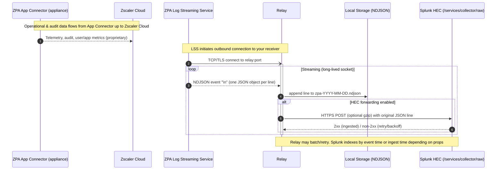

Relay is a high-performance TCP relay service that receives Zscaler ZPA LSS (Log Streaming Service) data and forwards it to Splunk HEC (HTTP Event Collector). The application acts as a streaming middleware that persists logs locally as NDJSON files and optionally forwards them to Splunk HEC in real-time.

## Features

- **Multi-Listener Support**: Configure multiple ports for different ZPA log types
- **TCP Server**: Accepts incoming connections from Zscaler ZPA LSS
- **Data Validation**: JSON validation for incoming log lines
- **Local Storage**: Daily-rotated NDJSON file persistence with configurable prefixes
- **Splunk HEC Integration**: Optional real-time forwarding to Splunk's HTTP Event Collector
- **Multi-Target HEC Support**: Forward to multiple Splunk endpoints with configurable routing (all, primary-failover, round-robin)
- **Batch Forwarding**: Configurable batching of events for improved HEC throughput
- **Circuit Breaker**: Automatic failure detection and recovery for HEC forwarding resilience
- **TLS Support**: Optional TLS encryption for incoming connections
- **Access Control**: CIDR-based IP filtering per listener
- **YAML Configuration**: Required configuration file for all settings
- **Template Generation**: Built-in configuration template generator
- **Health Checks**: Smoke testing for Splunk HEC connectivity
- **Graceful Shutdown**: Handles system signals for clean service termination with batch flush

## How it Works



## Requirements

- Go 1.21 or later
- Access to a Splunk instance with HEC enabled
- Network connectivity between Zscaler ZPA and the relay service

## Installation

### From Source

```bash
git clone https://github.com/scottbrown/relay.git
cd relay
go build -o relay cmd/relay/main.go
```

### Using Task Runner

If you have [Task](https://taskfile.dev/) installed:

```bash
task build
```

This creates the binary at `.build/relay`.

## Configuration

### Configuration File (Required)

The application requires a YAML configuration file. Create one using the template generator:

```bash
./relay template > config.yml
```

Example configuration with multiple listeners:

```yaml
# Global Splunk HEC configuration (shared across all listeners unless overridden)
splunk:
  hec_url: "https://your-instance.splunkcloud.com:8088/services/collector/raw"
  hec_token: "your-hec-token-here"
  gzip: true
  # Batch forwarding configuration for improved throughput (optional)
  batch:
    enabled: true                 # Enable/disable batch forwarding (default: false)
    max_size: 100                 # Maximum lines per batch (default: 100)
    max_bytes: 1048576            # Maximum bytes per batch (default: 1 MiB)
    flush_interval_seconds: 1     # Maximum seconds before flushing (default: 1)
  # Circuit breaker configuration for HEC forwarding resilience
  circuit_breaker:
    enabled: true                 # Enable/disable circuit breaker (default: true)
    failure_threshold: 5          # Open circuit after N consecutive failures (default: 5)
    success_threshold: 2          # Close circuit after N consecutive successes (default: 2)
    timeout_seconds: 30           # Seconds before testing recovery (default: 30)
    half_open_max_calls: 1        # Max concurrent test calls in half-open state (default: 1)

# Global healthcheck configuration
health_check_enabled: true
health_check_addr: ":9099"

# Listener configurations (one per ZPA log type)
listeners:
  # User Activity logs
  - name: "user-activity"
    listen_addr: ":9015"
    log_type: "user-activity"
    output_dir: "./zpa-logs"
    file_prefix: "zpa-user-activity"
    allowed_cidrs: "10.0.0.0/8"
    max_line_bytes: 1048576
    splunk:
      source_type: "zpa:user:activity"

  # User Status logs
  - name: "user-status"
    listen_addr: ":9016"
    log_type: "user-status"
    output_dir: "./zpa-logs"
    file_prefix: "zpa-user-status"
    allowed_cidrs: "10.0.0.0/8"
    max_line_bytes: 1048576
    splunk:
      source_type: "zpa:user:status"
```

### Generate Configuration Template

```bash
./relay template > config.yml
```

### Global Configuration Options

| Option | Description | Required | Default |
|--------|-------------|----------|---------|
| `splunk.hec_url` | Global Splunk HEC raw endpoint URL | No | - |
| `splunk.hec_token` | Global Splunk HEC authentication token | No | - |
| `splunk.gzip` | Global gzip compression for HEC | No | - |
| `splunk.batch.enabled` | Enable batch forwarding for HEC | No | `false` |
| `splunk.batch.max_size` | Maximum lines per batch | No | `100` |
| `splunk.batch.max_bytes` | Maximum bytes per batch | No | `1048576` |
| `splunk.batch.flush_interval_seconds` | Max seconds before flushing | No | `1` |
| `splunk.circuit_breaker.enabled` | Enable circuit breaker for HEC | No | `true` |
| `splunk.circuit_breaker.failure_threshold` | Failures before opening circuit | No | `5` |
| `splunk.circuit_breaker.success_threshold` | Successes before closing circuit | No | `2` |
| `splunk.circuit_breaker.timeout_seconds` | Seconds before testing recovery | No | `30` |
| `splunk.circuit_breaker.half_open_max_calls` | Max concurrent calls in half-open | No | `1` |
| `health_check_enabled` | Enable healthcheck endpoint | No | `false` |
| `health_check_addr` | Healthcheck listen address | No | `:9099` |

### Per-Listener Configuration Options

| Option | Description | Required | Default |
|--------|-------------|----------|---------|
| `name` | Friendly identifier for the listener | Yes | - |
| `listen_addr` | TCP listen address | Yes | - |
| `log_type` | ZPA log type (must be valid) | Yes | - |
| `output_dir` | Directory for NDJSON files | Yes | - |
| `file_prefix` | File naming prefix | Yes | - |
| `tls.cert_file` | TLS certificate file | No | - |
| `tls.key_file` | TLS key file | No | - |
| `allowed_cidrs` | Comma-separated allowed CIDRs | No | - |
| `max_line_bytes` | Max bytes per JSON line | No | `1048576` |
| `splunk.source_type` | Splunk sourcetype for this listener | Yes* | - |
| `splunk.hec_url` | Override global HEC URL | No | - |
| `splunk.hec_token` | Override global HEC token | No | - |
| `splunk.gzip` | Override global gzip setting | No | - |

\* Required if global or per-listener HEC is configured

### Valid Log Types

- `user-activity`
- `user-status`
- `app-connector-status`
- `pse-status`
- `browser-access`
- `audit`
- `app-connector-metrics`
- `pse-metrics`

### Startup Configuration Validation

The application performs comprehensive "fail fast" validation during startup to detect configuration issues before beginning normal operation. This ensures runtime failures are minimised and problems are caught early.

**Validations Performed:**

1. **TLS Certificate Validation**
   - Verifies TLS certificate and key files exist and are readable
   - Loads the certificate to ensure it's valid and properly formatted
   - Both cert and key must be specified together

2. **Storage Directory Validation**
   - Creates output directories if they don't exist (including nested paths)
   - Tests directory writability by creating a temporary test file
   - Ensures proper permissions before accepting connections

3. **Splunk HEC Configuration Validation**
   - Validates HEC URL format (must be HTTP or HTTPS with valid host)
   - Ensures HEC token is present when HEC URL is configured
   - Verifies sourcetype is specified when HEC forwarding is enabled

4. **Network Configuration Validation**
   - Verifies listen addresses are available by attempting to bind
   - Detects port conflicts and address-in-use errors at startup
   - Tests actual network connectivity before starting service

5. **CIDR Access Control Validation**
   - Parses and validates CIDR notation for allowed_cidrs
   - Ensures proper IP address and subnet mask format
   - Detects invalid CIDR expressions early

**Example Error Messages:**

```
Error: listener user-activity: TLS cert file not accessible: open /path/to/cert.pem: no such file or directory
Error: listener user-activity: failed to load TLS certificate: tls: failed to find any PEM data
Error: listener user-activity: output directory not writable: permission denied
Error: listener user-activity: invalid HEC URL: HEC URL must use http or https scheme
Error: listener user-activity: HEC token required when HEC URL is specified
Error: listener user-activity: invalid CIDR list: invalid CIDR address: invalid-cidr
Error: listener user-activity: cannot bind to listen address: address already in use
```

**Benefits:**

- Detects configuration errors immediately at startup
- Provides clear, actionable error messages
- Prevents runtime failures during normal operation
- Reduces mean time to resolution for configuration issues

### Batch Forwarding

Batch forwarding significantly improves HEC throughput by combining multiple log events into a single HTTP request, reducing network overhead and improving overall performance.

**How it works:**

When batch forwarding is enabled, events are buffered and flushed to Splunk HEC based on three configurable triggers:

1. **Size trigger**: Flush when the batch reaches `max_size` lines
2. **Byte trigger**: Flush when the batch reaches `max_bytes` total size
3. **Time trigger**: Flush when `flush_interval_seconds` elapses since the first event in the batch

Additionally, any remaining buffered events are automatically flushed during graceful shutdown.

**Configuration examples:**

High throughput (larger batches, less frequent flushes):
```yaml
splunk:
  batch:
    enabled: true
    max_size: 500
    max_bytes: 5242880  # 5 MiB
    flush_interval_seconds: 5
```

Low latency (smaller batches, more frequent flushes):
```yaml
splunk:
  batch:
    enabled: true
    max_size: 10
    max_bytes: 102400  # 100 KiB
    flush_interval_seconds: 0.1
```

**Performance impact:**

- **Throughput**: 10-100x reduction in HTTP overhead for high-volume streams
- **Network**: Dramatically fewer connections and requests to HEC
- **CPU**: Lower CPU usage on both relay and Splunk HEC
- **Latency**: Slight increase in end-to-end latency due to buffering (configurable via `flush_interval_seconds`)

**Trade-offs:**

- Batching disabled (default): Lower latency, higher overhead
- Batching enabled: Higher throughput, slightly higher latency

**Note:** Batch forwarding is disabled by default to maintain backward compatibility. Enable it explicitly for improved performance in high-volume environments.

### Multi-Target HEC Support

Relay supports forwarding logs to multiple Splunk HEC endpoints simultaneously. This enables use cases like:

- **High Availability**: Forward to primary and backup Splunk instances
- **Multi-Tenancy**: Send logs to different Splunk indexes or instances
- **Disaster Recovery**: Maintain redundant log copies across geographies
- **Load Distribution**: Distribute logs across multiple Splunk indexers

**Configuration:**

Instead of using the legacy single `hec_url` and `hec_token` fields, define multiple targets using the `hec_targets` array:

```yaml
splunk:
  hec_targets:
    - name: primary
      hec_url: "https://splunk1.example.com:8088/services/collector/raw"
      hec_token: "token1"
      source_type: "zpa:logs"
      gzip: true

    - name: secondary
      hec_url: "https://splunk2.example.com:8088/services/collector/raw"
      hec_token: "token2"
      source_type: "zpa:logs"
      gzip: true

    - name: backup
      hec_url: "https://splunk3.example.com:8088/services/collector/raw"
      hec_token: "token3"
      source_type: "zpa:logs"
      gzip: false

  routing:
    mode: all  # Options: all, primary-failover, round-robin
```

**Routing Modes:**

1. **All (Broadcast)**
   - Sends every log line to all configured targets concurrently
   - Ideal for: HA, DR, multi-tenant deployments
   - Behavior: Continues even if some targets fail

   ```yaml
   routing:
     mode: all
   ```

2. **Primary-Failover**
   - Tries targets in order, fails over to next target if primary fails
   - Ideal for: Primary/backup configurations
   - Behavior: Only uses secondary if primary is unavailable

   ```yaml
   routing:
     mode: primary-failover
   ```

3. **Round-Robin**
   - Distributes logs across targets evenly
   - Ideal for: Load balancing across multiple indexers
   - Behavior: Each log goes to exactly one target in rotation

   ```yaml
   routing:
     mode: round-robin
   ```

**Per-Target Configuration:**

Each target supports individual configuration for:
- `gzip`: Compression setting
- `batch`: Batching configuration (same options as global)
- `circuit_breaker`: Circuit breaker settings (same options as global)

```yaml
splunk:
  hec_targets:
    - name: high-throughput
      hec_url: "https://splunk1.example.com:8088/services/collector/raw"
      hec_token: "token1"
      source_type: "zpa:logs"
      gzip: true
      batch:
        enabled: true
        max_size: 500
        max_bytes: 5242880
        flush_interval_seconds: 5
      circuit_breaker:
        enabled: true
        failure_threshold: 3
        timeout_seconds: 15

    - name: backup
      hec_url: "https://splunk2.example.com:8088/services/collector/raw"
      hec_token: "token2"
      source_type: "zpa:logs"
      gzip: false
      circuit_breaker:
        enabled: false
```

**Per-Listener Multi-Target Configuration:**

Multi-target configuration can be specified per-listener to send different log types to different Splunk instances:

```yaml
listeners:
  - name: "user-activity"
    listen_addr: ":9015"
    log_type: "user-activity"
    output_dir: "./zpa-logs"
    file_prefix: "zpa-user-activity"
    splunk:
      hec_targets:
        - name: production
          hec_url: "https://prod-splunk.example.com:8088/services/collector/raw"
          hec_token: "prod-token"
          source_type: "zpa:user:activity"
        - name: analytics
          hec_url: "https://analytics-splunk.example.com:8088/services/collector/raw"
          hec_token: "analytics-token"
          source_type: "zpa:user:activity"
      routing:
        mode: all
```

**Backward Compatibility:**

The legacy single HEC configuration is still supported for existing deployments:

```yaml
splunk:
  hec_url: "https://splunk.example.com:8088/services/collector/raw"
  hec_token: "token"
  # ... other options
```

**Note:** You cannot mix legacy single HEC configuration (`hec_url`/`hec_token`) with multi-target configuration (`hec_targets`) in the same scope (either global or per-listener). Choose one approach.

**Health Checks:**

When using multi-target configuration, health checks verify connectivity to all configured targets. The relay will fail to start if any target is unreachable or has invalid credentials.

**Logging:**

Each target's forwarding success/failure is logged separately with the target name:

```json
{"time":"2025-11-12T10:15:45.680Z","level":"DEBUG","msg":"HEC forward succeeded for target","target":"primary","conn_id":"550e8400-e29b-41d4-a716-446655440000"}
{"time":"2025-11-12T10:15:45.750Z","level":"WARN","msg":"HEC forward failed for target","target":"backup","conn_id":"550e8400-e29b-41d4-a716-446655440000","error":"connection refused"}
```

## Usage

### Basic Usage

```bash
# Run with configuration file (required)
./relay --config /path/to/config.yml

# Short form
./relay -f config.yml

# Generate configuration template
./relay template > config.yml

# Test Splunk HEC connectivity for all listeners
./relay smoke-test --config config.yml
```

### Commands

| Command | Description |
|---------|-------------|
| (default) | Start the relay service |
| `template` | Generate configuration template and exit |
| `smoke-test` | Test Splunk HEC connectivity for all listeners and exit |

### Command-Line Options

```bash
./relay [command] --config <path> [--log-level <level>]

Options:
  -f, --config string
        Path to configuration file (required)
      --log-level string
        Log level: debug, info, warn, error (default "info")
```

### Running Directly with Go

```bash
go run cmd/relay/main.go --config config.yml
```

## Architecture

### Data Flow

1. **Multi-Listener Setup**: Configure multiple TCP/TLS listeners, one per ZPA log type
2. **Access Control**: Optional CIDR-based filtering for incoming connections per listener
3. **Data Validation**: Incoming NDJSON data is validated and line-limited for security
4. **Local Storage**: Data is persisted locally to daily-rotated files ({file_prefix}-YYYY-MM-DD.ndjson)
5. **Real-time Forwarding**: Optional concurrent forwarding to Splunk HEC raw endpoint with retry logic and circuit breaker protection

### Circuit Breaker Pattern

The circuit breaker protects the application from cascading failures when Splunk HEC is down or experiencing issues. It implements a state machine with three states:

**States:**

1. **Closed (Normal Operation)**
   - All HEC forward attempts proceed normally
   - Consecutive failures are tracked
   - Circuit opens after reaching failure threshold (default: 5 failures)

2. **Open (Failing Fast)**
   - HEC forward attempts are immediately rejected without trying
   - Logs continue to be stored locally
   - After timeout period (default: 30s), circuit transitions to half-open

3. **Half-Open (Testing Recovery)**
   - Limited number of test requests allowed through (default: 1)
   - If test succeeds: circuit closes and normal operation resumes
   - If test fails: circuit reopens and timeout restarts

**Example Behaviour:**

```
# HEC is healthy
[INFO] forwarding to HEC (state=closed)

# HEC starts failing
[WARN] HEC forward failed, attempt 1/5
[WARN] HEC forward failed, attempt 5/5
[WARN] circuit breaker opened after 5 consecutive failures

# Circuit is open (failing fast, logs still stored locally)
[WARN] circuit breaker open, skipping HEC forward

# After 30s timeout
[INFO] circuit breaker half-open, testing recovery
[INFO] HEC forward successful
[INFO] circuit breaker closed, HEC recovered
```

**Benefits:**
- Prevents wasting resources on doomed requests
- Enables faster failure detection
- Automatic recovery when HEC becomes healthy
- Logs are always stored locally regardless of HEC state
- Can be disabled by setting `failure_threshold: 0`

### Event Format

Data is forwarded to Splunk HEC as raw JSON events (one per line) without additional wrapping. The sourcetype is configurable per listener (e.g., "zpa:user:activity", "zpa:audit").

## Monitoring and Logging

### Structured Logging

The service uses Go's built-in `log/slog` package for structured JSON logging to stderr. This provides consistent, parseable logs with contextual fields for easier debugging and monitoring.

**Log Levels:**

Configure the log level using the `--log-level` flag:

```bash
./relay --config config.yml --log-level debug
```

Available levels:
- `debug`: Detailed diagnostic information (connection details, JSON validation, healthcheck requests)
- `info`: Normal operational messages (connections, file rotation, HEC forwards) - **default**
- `warn`: Recoverable issues (retry attempts, validation failures, ACL denials)
- `error`: Serious problems (storage failures, HEC configuration errors)

**Example Log Output:**

```json
{"time":"2025-11-11T10:15:30.123Z","level":"INFO","msg":"loaded configuration","file":"config.yml"}
{"time":"2025-11-11T10:15:30.456Z","level":"INFO","msg":"healthcheck server listening","addr":":9099"}
{"time":"2025-11-11T10:15:30.789Z","level":"INFO","msg":"initialized listener","listener":"user-activity","log_type":"user-activity","addr":":9015"}
{"time":"2025-11-11T10:15:31.123Z","level":"INFO","msg":"server listening","addr":":9015","tls_enabled":true}
{"time":"2025-11-11T10:15:45.678Z","level":"INFO","msg":"connection accepted","client_addr":"10.0.1.5:54321"}
{"time":"2025-11-11T10:15:46.234Z","level":"WARN","msg":"connection denied by ACL","client_ip":"192.168.1.100"}
{"time":"2025-11-11T10:15:50.890Z","level":"ERROR","msg":"storage write failed","error":"disk full"}
```

**Contextual Fields:**

Logs include contextual information for easier filtering and analysis:
- **Server logs**: `addr`, `tls_enabled`, `client_addr`, `client_ip`
- **Listener logs**: `listener`, `log_type`
- **Storage logs**: File paths and bytes written
- **HEC logs**: URLs, response status, retry attempts
- **ACL logs**: Client IPs and CIDR match/reject reasons

**Integration with Log Aggregation:**

The JSON output format integrates easily with log aggregation tools:

```bash
# Send to file
./relay --config config.yml 2>> relay.log

# Send to journald (systemd)
./relay --config config.yml  # stderr captured automatically

# Parse with jq
./relay --config config.yml 2>&1 | jq 'select(.level=="ERROR")'

# Forward to Splunk/ELK
./relay --config config.yml 2>&1 | your-log-forwarder
```

### Request Tracing with Correlation IDs

Every incoming connection is assigned a unique correlation ID (UUID v4) that tracks the request through the entire processing pipeline. This enables end-to-end tracing and debugging of individual connections.

**How It Works:**

1. When a connection is accepted, a unique correlation ID is generated
2. The ID is included in all log messages for that connection
3. The ID is sent as an HTTP header (`X-Correlation-ID`) when forwarding to Splunk HEC
4. This enables correlation between relay logs and Splunk ingestion logs

**Example Log Output:**

```json
{"time":"2025-11-11T10:15:45.678Z","level":"INFO","msg":"connection accepted","conn_id":"550e8400-e29b-41d4-a716-446655440000","client_addr":"10.0.1.5:54321"}
{"time":"2025-11-11T10:15:45.679Z","level":"DEBUG","msg":"stored line","conn_id":"550e8400-e29b-41d4-a716-446655440000","bytes":1024}
{"time":"2025-11-11T10:15:45.680Z","level":"DEBUG","msg":"forwarding to HEC","conn_id":"550e8400-e29b-41d4-a716-446655440000","hec_url":"https://splunk.example.com:8088/services/collector/raw"}
{"time":"2025-11-11T10:15:45.750Z","level":"DEBUG","msg":"HEC forward succeeded","conn_id":"550e8400-e29b-41d4-a716-446655440000","status":200}
{"time":"2025-11-11T10:15:48.123Z","level":"DEBUG","msg":"connection closed","conn_id":"550e8400-e29b-41d4-a716-446655440000","client_addr":"10.0.1.5:54321"}
```

**Tracing a Specific Connection:**

Use `grep` to trace the entire lifecycle of a connection:

```bash
# Trace all activity for a specific connection ID
grep '550e8400-e29b-41d4-a716-446655440000' relay.log

# Using jq for structured filtering
jq 'select(.conn_id == "550e8400-e29b-41d4-a716-446655440000")' relay.log

# Find all connections from a specific client
jq 'select(.client_addr == "10.0.1.5:54321")' relay.log
```

**Benefits:**

- Trace individual connections through the entire pipeline
- Correlate relay logs with Splunk HEC ingestion logs
- Debug specific connection issues without noise from other connections
- Monitor connection lifecycle (accept → validate → store → forward → close)
- Identify performance bottlenecks for specific requests

## Development

### Prerequisites

- Go 1.24.4+
- Task runner (optional)

### Building

```bash
# Using Go directly
go build -o relay cmd/relay/main.go

# Using Task
task build
```

### Running Tests

```bash
# Run unit tests
go test -v ./...

# Run with coverage
task coverage

# Run integration tests
task integration
```

### Integration Testing

The project includes a comprehensive integration test harness that validates the complete pipeline without requiring live ZPA App Connectors or Splunk HEC instances.

**Running Integration Tests:**

```bash
# Using Task runner (recommended)
task integration

# Or directly with Go
go test -tags=integration -v ./internal/integration/...
```

**Test Coverage:**

The integration tests validate:
- End-to-end data flow (happy path)
- Malformed JSON handling
- Oversized line rejection
- HEC failure and retry logic
- Gzip compression
- CIDR-based access control

**Test Infrastructure:**

- Mock ZPA client for streaming NDJSON logs
- Mock Splunk HEC server with configurable responses
- Relay launcher for temporary test instances
- Test fixtures for various scenarios

For detailed information about the integration test harness, see [TESTING.SPEC.md](TESTING.SPEC.md).

### Performance Benchmarks

The project includes comprehensive benchmarks for critical performance paths to help identify bottlenecks and prevent regressions.

**Running Benchmarks:**

```bash
# Using Task runner (recommended)
task bench

# Or directly with Go
go test -bench=. -benchmem -run=^$ ./internal/...

# Run specific package benchmarks
go test -bench=. -benchmem ./internal/processor/
go test -bench=. -benchmem ./internal/storage/
go test -bench=. -benchmem ./internal/forwarder/
go test -bench=. -benchmem ./internal/server/

# Save baseline for comparison
go test -bench=. -benchmem ./internal/... > baseline.txt

# Compare with previous baseline using benchstat
go install golang.org/x/perf/cmd/benchstat@latest
benchstat baseline.txt new.txt
```

**Benchmark Coverage:**

The benchmarks validate performance of:
- **Processor Package**: Line reading with various sizes (100B to 1MB), JSON validation, oversized line handling
- **Storage Package**: Write operations with different payload sizes, concurrent writes, file rotation logic
- **Forwarder Package**: HEC forwarding with/without gzip, different payload sizes, retry logic overhead
- **Server Package**: End-to-end connection handling with various scenarios

**Interpreting Results:**

Benchmark results show:
- **ns/op**: Nanoseconds per operation (lower is better)
- **B/op**: Bytes allocated per operation (lower is better)
- **allocs/op**: Number of allocations per operation (lower is better)
- **MB/s**: Throughput in megabytes per second (when applicable, higher is better)

**Example Output:**

```
BenchmarkReadLineLimited_Small-8       1000000    1234 ns/op    512 B/op    4 allocs/op
BenchmarkWrite_Medium-8                 500000    2345 ns/op   1024 B/op    2 allocs/op
BenchmarkForward_Large_Gzip-8           100000   12345 ns/op   2048 B/op    8 allocs/op
```

### Dependencies

- `gopkg.in/yaml.v3` - YAML configuration parsing
- Go standard library only

## Deployment

### Systemd Service

Create `/etc/systemd/system/relay.service`:

```ini
[Unit]
Description=Zscaler ZPA LSS Relay Service
After=network.target

[Service]
Type=simple
User=relay
ExecStart=/usr/local/bin/relay -f /etc/relay/config.yml
Restart=always
RestartSec=5

[Install]
WantedBy=multi-user.target
```

Enable and start:

```bash
sudo systemctl enable relay
sudo systemctl start relay
```

### Docker

```dockerfile
FROM golang:1.24-alpine AS builder
WORKDIR /app
COPY . .
RUN go build -o relay cmd/relay/main.go

FROM alpine:latest
RUN apk --no-cache add ca-certificates
WORKDIR /root/
COPY --from=builder /app/relay .
COPY config.yml .
CMD ["./relay", "-f", "config.yml"]
```

## Troubleshooting

### Common Issues

1. **Connection Refused**: Ensure the listen port is not in use and firewall allows connections
2. **Splunk HEC Errors**: Verify HEC URL and token are correct
3. **Permission Denied**: Check file permissions for configuration file
4. **Memory Usage**: Monitor batch size settings for high-volume environments

### Logs

Check service logs for diagnostic information:

```bash
# Systemd
journalctl -u relay -f

# Docker
docker logs <container_id>
```

## Documentation

Documentation is organised using the [Diátaxis framework](https://diataxis.fr/) for clarity and discoverability. See [docs/](docs/) for the complete documentation structure.

### Architecture Decision Records

Key architectural decisions and their rationale are documented as Architecture Decision Records (ADRs). See [docs/explanation/adr/](docs/explanation/adr/) for the complete list of decisions including:

- Why we use Go Task instead of Make
- Daily log rotation based on UTC
- NDJSON format for local storage
- Store-first, forward-second approach
- And more...

## Contributing

1. Fork the repository
2. Create a feature branch
3. Make your changes
4. Add tests if applicable
5. Submit a pull request

## License

This project is licensed under the MIT License - see the [LICENSE](LICENSE) file for details.

## Support

For issues and questions:
- Create an issue in the GitHub repository
- Check the troubleshooting section above
- Review logs for error messages
